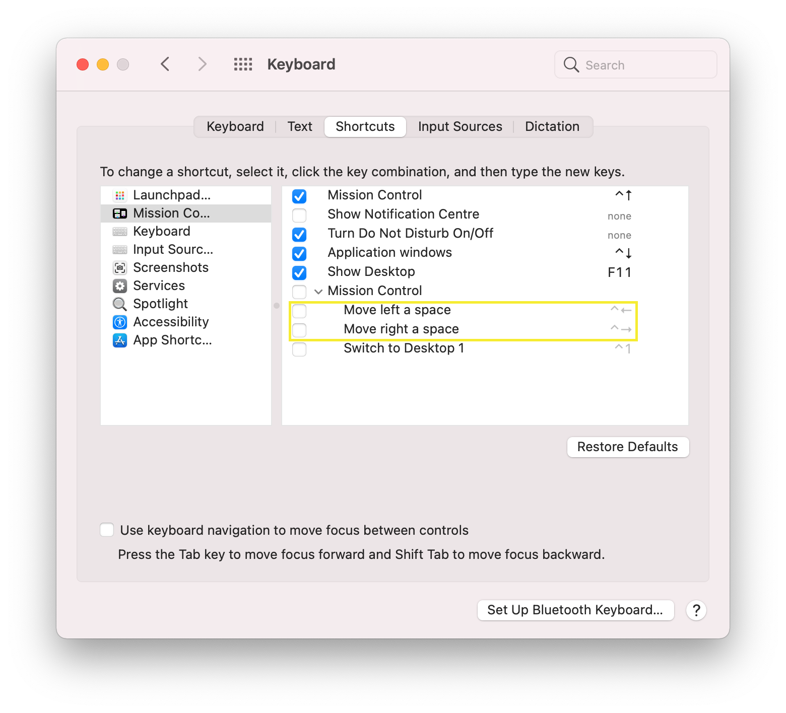

# My Dotfiles

## Overview

This repository contains my personal dotfiles, managed using [chezmoi](https://www.chezmoi.io/). It sets up my development environment, including configurations for Zsh, Neovim, Git, and various development tools. Tool versions are managed using [mise-en-place](https://mise.jdx.dev/).

## Installation

1.  **Install chezmoi:** Follow the instructions on the [chezmoi installation guide](https://www.chezmoi.io/install/).
2.  **Initialize chezmoi with this repository:**
    ```bash
    chezmoi init https://github.com/laurigates/dotfiles.git
    ```
3.  **Review the changes:** Check which files chezmoi plans to create or modify.
    ```bash
    chezmoi diff
    ```
4.  **Apply the changes:**
    ```bash
    chezmoi apply -v
    ```

## Tool Management with mise-en-place

This setup uses [mise-en-place](https://mise.jdx.dev/) (formerly `rtx`) to manage development tool versions (like Node.js, Python, Go, etc.).

-   Tool versions are defined in the `.config/mise/config.toml` file (managed by chezmoi).
-   After cloning or updating the dotfiles, run `mise install` in your shell to install the specified tool versions.
-   `mise` automatically activates the correct tool versions when you enter a directory containing a `mise.toml` or `.tool-versions` file.

## Platform Specific Notes

### zkbd Configuration

Run `zkbd` after installation to configure Zsh key bindings if needed.

### macOS Specific Notes

#### Key Bindings

Ensure macOS key bindings are configured to allow focus switching between windows if desired.

#### Jumping Between Words (Terminal)

To use `Ctrl+Left Arrow` and `Ctrl+Right Arrow` for word jumping in Zsh/terminal applications, you may need to disable the default macOS Mission Control shortcuts for these key combinations in System Settings > Keyboard > Keyboard Shortcuts > Mission Control.



## Container Testing

You can test the dotfiles configuration within a container environment.

### Build the Container

Use Docker or Podman:

```bash
# Using Docker
docker build . -t laurigates/dotfiles

# Using Podman
podman build . -t laurigates/dotfiles --format docker
```

### Run the Container

```bash
# Using Docker
docker run --rm -it laurigates/dotfiles:latest

# Using Podman
podman run --rm -it laurigates/dotfiles:latest
```

Inside the container, the dotfiles should be applied, providing the configured Zsh and Neovim environment.

## Debugging

### Debugging PATH

To see how the `PATH` variable is constructed, especially with `mise` integration:

```bash
zsh -x -c 'printenv PATH' 2>&1 | rg PATH
```
Or use `mise`'s built-in debugging:
```bash
mise doctor
mise exec -- zsh -x -c 'printenv PATH' 2>&1 | rg PATH
```


### Debugging Neovim Configuration

-   **Start Neovim in a clean state:**
    ```bash
    nvim --clean
    ```
    *(Note: Modern Neovim often doesn't require `-u init.lua` if `init.lua` is standard)*

-   **Debug LSP configuration:**
    ```
    :LspInfo
    :LspLog
    :checkhealth
    ```
    *(Note: `:Neoconf` might be specific to a plugin; standard commands are `:LspInfo`, `:LspLog`, `:checkhealth`)*

### Debugging Zsh Completions

If completions are not working correctly:

```bash
rm -f ~/.zcompdump* # Remove existing dump files
exec zsh # Restart Zsh to regenerate completions
```

## Verifying Zsh Environment

After installation, check the following Zsh features:

-   `git <tab>`: Should trigger FZF-based completions (potentially via `fzf-tab`).
-   `kubectl <tab>`: Should provide Kubernetes completions.
-   `ctrl+r`: Opens FZF history search.
-   `alt/option+c`: Opens FZF directory search (`cd` into selected directory).
-   `ctrl+t`: Opens FZF file search (insert selected file path).
-   `fzf` (command): Should display syntax-highlighted previews if `bat` is integrated.
-   `stty -a`: Displays current terminal settings.
