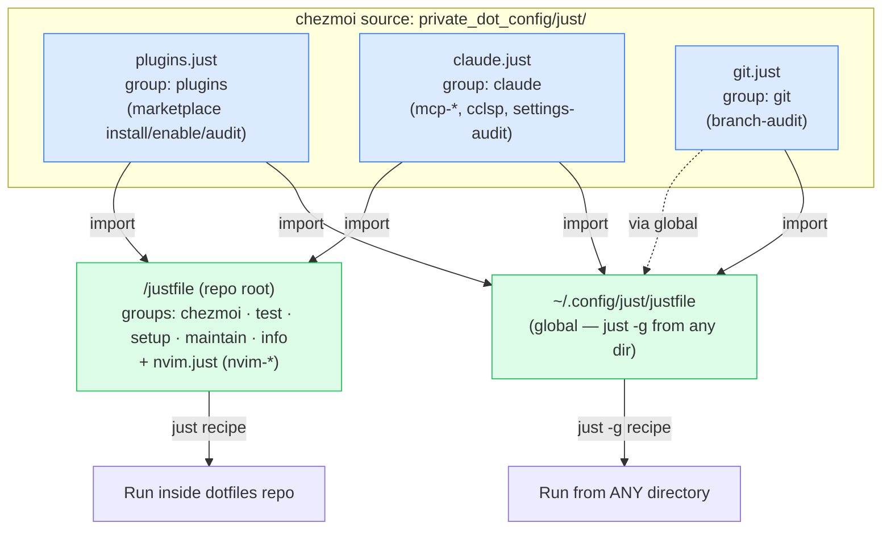
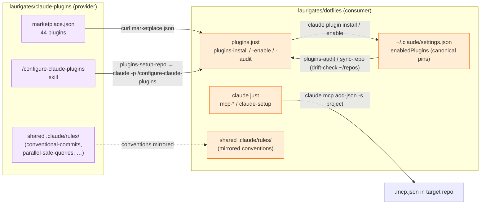

# Justfile Architecture & the claude-plugins Symbiosis

How this repo's `just` recipes are organised, why they are split across shared
`.just` modules, and how the `plugins-*` / `mcp-*` recipes bridge this repo to
its sibling [`laurigates/claude-plugins`](https://github.com/laurigates/claude-plugins).

See [ADR-0012](adrs/0012-justfile-command-runner.md) for *why* `just` replaced
Make. This document covers the *layout* after the 2026-07 grouping/dedup pass.

## Module layout

The recipes live in one root justfile plus three shared modules under
`private_dot_config/just/` (chezmoi source → `~/.config/just/`). The modules are
the **single source of truth**: they are imported by both the in-repo root
justfile *and* the global justfile, so `just <recipe>` (inside this repo) and
`just -g <recipe>` (from anywhere) resolve the exact same recipe.

**Why the split:** `plugins-*`, `mcp-*`, and `branch-audit` are useful from
*any* repo (they operate on the current directory or the `~/repos` portfolio),
so they must be reachable via `just -g`. Keeping them in importable sibling
modules — rather than inline in the root justfile — lets the global justfile
import the identical definitions. `claude_model` is defined inside `plugins.just`
(not an importer) precisely because both importers must inherit it.

> ⚠️ The global justfile is resolved from `~/.config/just/justfile`, **not**
> `~/.user.justfile` (which is not on `just`'s search path). See the
> chezmoi-conventions rule for the full search-path trap.

## Recipe groups

`just --list` renders recipes under their native `[group: …]` header. Every
recipe now carries a group so the listing is consistent across the root file and
the imported modules:

| Group | Source | Representative recipes |
|-------|--------|------------------------|
| `chezmoi` | root | `apply`, `diff`, `status`, `verify`, `capture-drift[-apply]` |
| `test` | root | `test`, `lint`, `lint-shell/lua/actions/brew`, `smoke*`, `ci` |
| `setup` | root | `setup`, `setup-brew`, `setup-mise`, `setup-nvim` |
| `maintain` | root | `update`, `bump`, `clean`, `secrets`, `update-claude-completion` |
| `info` | root | `docs`, `dev`, `edit`, `info`, `doctor` |
| `plugins` | `plugins.just` | `plugins-install/enable/disable/update/uninstall`, `plugins-audit`, `plugins-setup-repo` |
| `claude` | `claude.just` | `mcp-*`, `cclsp`, `claude-setup`, `settings-audit` |
| `git` | `git.just` | `branch-audit` |
| `nvim` | `nvim.just` | `nvim-plugins-audit` |

### Consolidations applied (2026-07)

- **`plugins-{enable,disable,update,uninstall}`** were four near-identical
  `claude plugin list --json | jq … | while read` loops. They now share one
  private `_plugins-foreach action filter` recipe and differ only in the action
  verb and an optional jq enabled-state filter.
- **`update`** no longer duplicates the Neovim sync block byte-for-byte; it
  depends on `setup-nvim` (the same `Lazy! sync` + `MasonUpdate` invocation),
  making `setup-nvim` the single source of truth for the nvim step.
- **Native `[group: …]` attributes** replaced comment-only section banners for
  the root recipes, so `just --list` groups them the way the imported modules
  were already grouped.

## Symbiosis with claude-plugins

The two repos are **provider ↔ consumer**. `claude-plugins` publishes a
marketplace and the skills; `dotfiles` installs, pins, and dogfoods them, and
its `just` recipes are the automation glue.

| Direction | Mechanism | Recipe / artifact |
|-----------|-----------|-------------------|
| provider → consumer | Marketplace fetch | `plugins-install` curls `claude-plugins` `marketplace.json` |
| provider → consumer | Repo configuration skill | `plugins-setup-repo` runs `claude -p "/configure-claude-plugins --fix"` |
| provider → consumer | Shared conventions | `.claude/rules/` (conventional-commits, parallel-safe-queries, gh-json-fields, bash-tool-replacements) exist in **both** repos |
| consumer → provider | Dogfooding & drift audit | `plugins-audit` / `plugins-sync-repo` compare committed pins against the canonical `~/.claude/settings.json` |
| consumer → provider | Authoring conventions | justfile style is governed by `tools-plugin:justfile-expert` + `configure-plugin:configure-justfile` in claude-plugins |

The relationship is **symbiotic**: claude-plugins gives dotfiles a versioned,
auditable plugin surface; dotfiles gives claude-plugins a real-world consumer
that exercises the marketplace, the `configure-claude-plugins` skill, and the
shared rule set on every `chezmoi apply`.

## Related

- [ADR-0012 — Justfile Command Runner](adrs/0012-justfile-command-runner.md)
- `.claude/rules/chezmoi-conventions.md` — the `just -g` search-path trap and the source-root `justfile` leak
- `claude-plugins` `tools-plugin:justfile-expert` — generic justfile authoring
- `claude-plugins` `configure-plugin:configure-justfile` — justfile auditing
