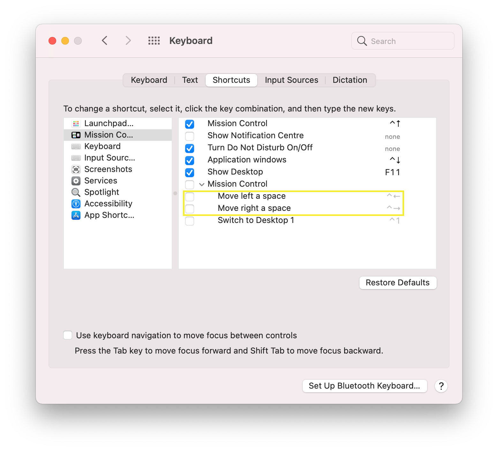

# Platform Specific Notes

## zkbd Configuration

Run `zkbd` after installation to configure Zsh key bindings if needed.

## macOS Specific Notes

### Key Bindings

Ensure macOS key bindings are configured to allow focus switching between windows if desired.

### Jumping Between Words (Terminal)

To use `Ctrl+Left Arrow` and `Ctrl+Right Arrow` for word jumping in Zsh/terminal applications, you may need to disable the default macOS Mission Control shortcuts for these key combinations in System Settings > Keyboard > Keyboard Shortcuts > Mission Control.

### Touch ID for sudo

`/etc/pam.d/sudo_local` is outside chezmoi's reach (root-owned, under `/etc`), so
it is set up by hand. This machine uses
[macos-sudo-touchid-context](https://github.com/laurigates/macos-sudo-touchid-context)
instead of Apple's `pam_tid.so`: its Touch ID dialog names the command and the
process that asked (for example a background `brew upgrade` installing a cask
`.pkg`). Install with `just install` from a clone, with a root shell open: a
module named in `sudo_local` that fails to load locks sudo.
