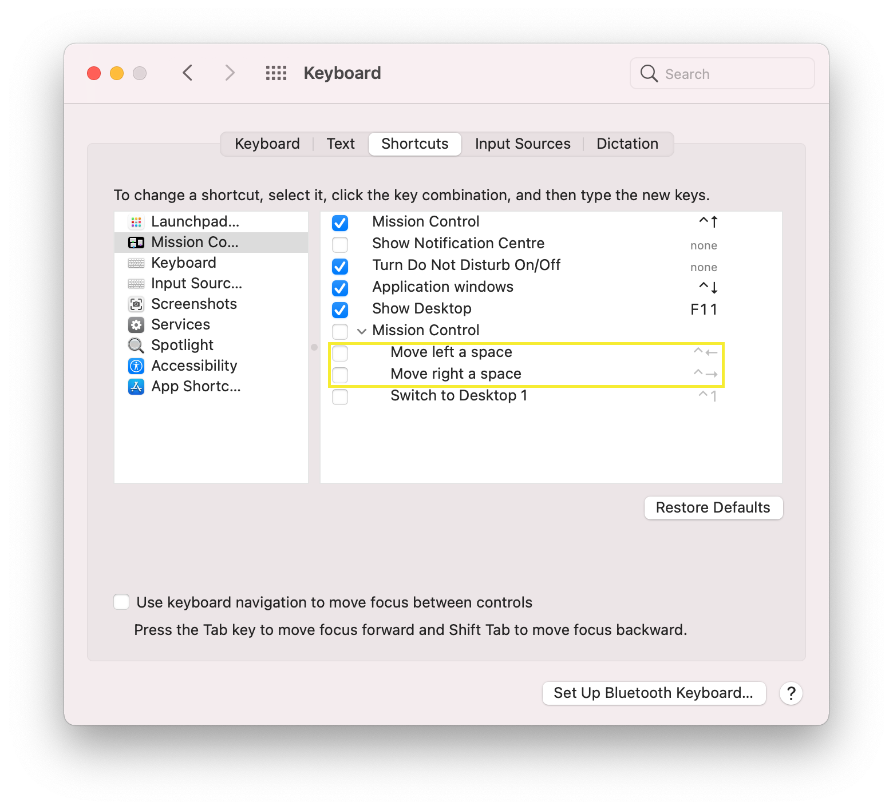

# Platform Specific Notes

## zkbd Configuration

Run `zkbd` after installation to configure Zsh key bindings if needed.

## macOS Specific Notes

### Key Bindings

Ensure macOS key bindings are configured to allow focus switching between windows if desired.

### Jumping Between Words (Terminal)

To use `Ctrl+Left Arrow` and `Ctrl+Right Arrow` for word jumping in Zsh/terminal applications, you may need to disable the default macOS Mission Control shortcuts for these key combinations in System Settings > Keyboard > Keyboard Shortcuts > Mission Control.

