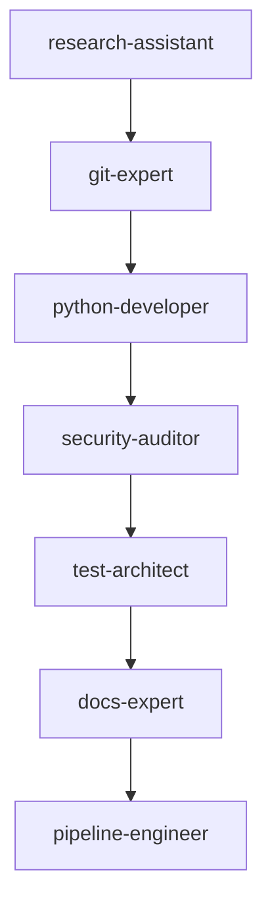
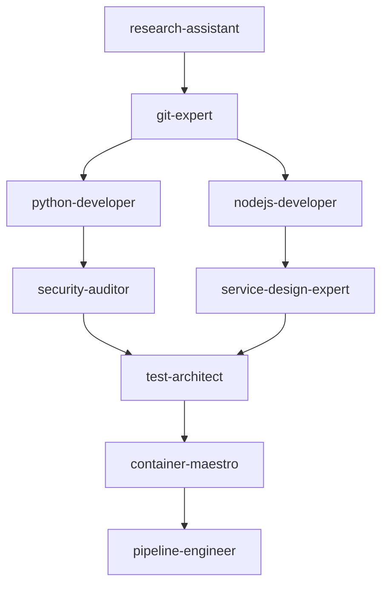
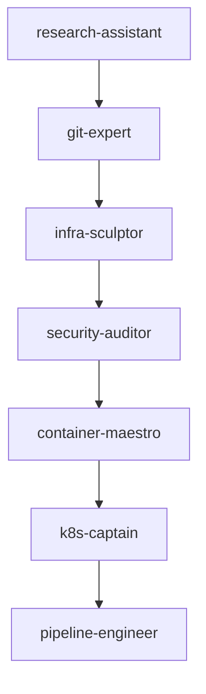
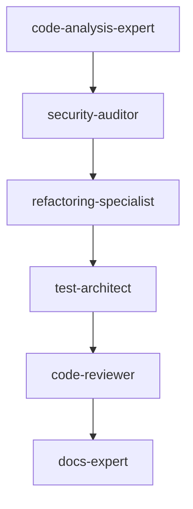
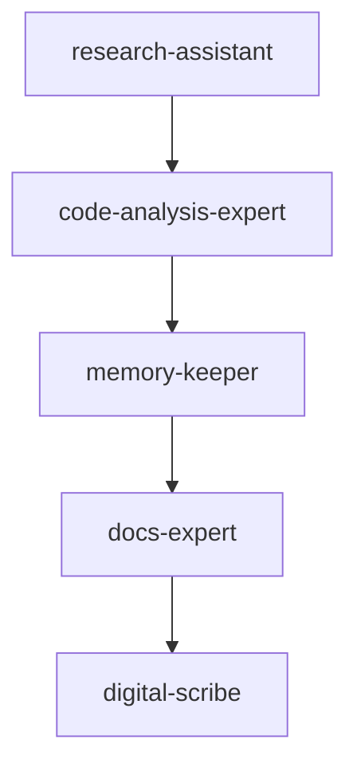

# Workflow Coordination Templates

This document provides pre-configured templates for common multi-agent development workflows. Each template includes file structures, agent sequences, and coordination patterns optimized for specific development scenarios.

## Template Categories

1. **API Development** - Backend API with database and testing
2. **Full-Stack Project** - Complete web application with frontend/backend
3. **Infrastructure Setup** - DevOps, CI/CD, and deployment workflows
4. **Code Quality Review** - Security audit, performance analysis, code review
5. **Documentation & Analysis** - Research, documentation, and technical analysis

## Template 1: API Development Workflow

### Use Case
Building a RESTful API with authentication, database integration, and comprehensive testing.

### Agent Sequence


### Template Files

#### `.claude/tasks/current-workflow.md`
```markdown
# API Development Workflow

**Workflow ID**: `api-dev-${timestamp}`
**Started**: `${current_time}`
**Status**: `ACTIVE`
**Main Objective**: Build secure REST API with authentication and database integration

## Progress Overview
- **Total Steps**: 7
- **Completed**: 0
- **In Progress**: 1
- **Pending**: 6
- **Overall Progress**: 0%

## Steps
1. 🔄 **Requirements Analysis** (research-assistant)
2. ⏳ **Repository Setup** (git-expert)
3. ⏳ **API Implementation** (python-developer)
4. ⏳ **Security Review** (security-auditor)
5. ⏳ **Test Suite** (test-architect)
6. ⏳ **Documentation** (docs-expert)
7. ⏳ **CI/CD Pipeline** (pipeline-engineer)

## Tech Stack
- **Backend**: FastAPI with Python 3.11
- **Database**: PostgreSQL with SQLAlchemy
- **Testing**: pytest with coverage
- **Security**: JWT authentication, password hashing
- **Documentation**: OpenAPI/Swagger
```

#### `.claude/tasks/inter-agent-context.json`
```json
{
  "workflow_type": "api_development",
  "project_context": {
    "name": "API Project",
    "type": "REST API",
    "tech_stack": {
      "backend": "FastAPI",
      "database": "PostgreSQL",
      "auth": "JWT",
      "testing": "pytest"
    }
  },
  "shared_requirements": {
    "authentication": "JWT with refresh tokens",
    "database_design": "User management with role-based access",
    "api_standards": "RESTful with OpenAPI documentation",
    "security_level": "Production-ready with OWASP compliance",
    "test_coverage": "Minimum 90% code coverage",
    "performance": "Sub-200ms response times"
  },
  "coordination_rules": {
    "code_style": "Black formatting, type hints required",
    "git_workflow": "Feature branches with PR reviews",
    "documentation": "Inline docstrings + OpenAPI specs",
    "security": "No secrets in code, environment variables only"
  }
}
```

## Template 2: Full-Stack Project Workflow

### Use Case
Complete web application with React frontend, API backend, database, and deployment.

### Agent Sequence


### Template Files

#### `.claude/tasks/current-workflow.md`
```markdown
# Full-Stack Development Workflow

**Workflow ID**: `fullstack-${timestamp}`
**Main Objective**: Build complete web application with modern tech stack

## Parallel Development Tracks

### Backend Track
1. ✅ **API Design** (research-assistant)
2. 🔄 **Backend Implementation** (python-developer)
3. ⏳ **Security Audit** (security-auditor)

### Frontend Track
1. ✅ **UI/UX Planning** (service-design-expert)
2. 🔄 **Frontend Implementation** (nodejs-developer)
3. ⏳ **Integration Testing** (test-architect)

### DevOps Track
1. ⏳ **Containerization** (container-maestro)
2. ⏳ **Deployment Pipeline** (pipeline-engineer)

## Integration Points
- **API Specification**: Backend provides OpenAPI spec for frontend
- **Authentication Flow**: Coordinated login/logout implementation
- **Database Schema**: Shared between backend and deployment
```

#### `.claude/tasks/inter-agent-context.json`
```json
{
  "workflow_type": "fullstack_development",
  "project_context": {
    "name": "Full-Stack Web App",
    "architecture": "SPA + REST API",
    "tech_stack": {
      "frontend": "Vue 3 + TypeScript + Vite",
      "backend": "FastAPI + Python",
      "database": "PostgreSQL",
      "deployment": "Docker + Kubernetes"
    }
  },
  "integration_requirements": {
    "api_contract": "OpenAPI 3.0 specification",
    "authentication": "JWT with HTTP-only cookies",
    "state_management": "Pinia for frontend state",
    "real_time": "WebSocket for live updates",
    "file_upload": "Multipart form data with validation"
  },
  "coordination_protocols": {
    "api_first": "Backend defines API contract before frontend implementation",
    "shared_types": "TypeScript types generated from API schema",
    "testing_strategy": "Backend unit tests + Frontend component tests + E2E integration",
    "deployment_strategy": "Blue-green deployment with health checks"
  }
}
```

## Template 3: Infrastructure Setup Workflow

### Use Case
Setting up complete DevOps infrastructure with CI/CD, monitoring, and security.

### Agent Sequence


### Template Files

#### `.claude/tasks/current-workflow.md`
```markdown
# Infrastructure Setup Workflow

**Workflow ID**: `infra-setup-${timestamp}`
**Main Objective**: Establish production-ready infrastructure with monitoring and security

## Infrastructure Layers

### Foundation Layer
1. 🔄 **Cloud Architecture** (infra-sculptor) - Terraform IaC
2. ⏳ **Security Baseline** (security-auditor) - Security groups, IAM, secrets

### Application Layer
3. ⏳ **Container Platform** (container-maestro) - Docker optimization
4. ⏳ **Kubernetes Cluster** (k8s-captain) - K8s deployment, ingress, monitoring

### Automation Layer
5. ⏳ **CI/CD Pipeline** (pipeline-engineer) - GitHub Actions, automated deployment

## Success Criteria
- ✅ Infrastructure as Code (100% Terraform managed)
- ✅ Zero-downtime deployments
- ✅ Automated security scanning
- ✅ Comprehensive monitoring and alerting
```

## Template 4: Code Quality Review Workflow

### Use Case
Comprehensive code review including security, performance, and maintainability analysis.

### Agent Sequence


### Template Files

#### `.claude/tasks/current-workflow.md`
```markdown
# Code Quality Review Workflow

**Workflow ID**: `quality-review-${timestamp}`
**Main Objective**: Comprehensive code quality assessment and improvement recommendations

## Review Phases

### Analysis Phase
1. 🔄 **Code Structure Analysis** (code-analysis-expert)
2. ⏳ **Security Vulnerability Scan** (security-auditor)

### Improvement Phase
3. ⏳ **Refactoring Opportunities** (refactoring-specialist)
4. ⏳ **Test Coverage Analysis** (test-architect)

### Documentation Phase
5. ⏳ **Final Code Review** (code-reviewer)
6. ⏳ **Documentation Updates** (docs-expert)

## Quality Metrics
- **Code Coverage**: Target 90%+
- **Security Score**: No high/critical vulnerabilities
- **Maintainability**: Cyclomatic complexity < 10
- **Performance**: No obvious bottlenecks
```

## Template 5: Research & Documentation Workflow

### Use Case
Technical research, analysis, and comprehensive documentation creation.

### Agent Sequence


### Template Files

#### `.claude/tasks/current-workflow.md`
```markdown
# Research & Documentation Workflow

**Workflow ID**: `research-docs-${timestamp}`
**Main Objective**: Comprehensive technical research with knowledge preservation

## Research Phases

### Discovery Phase
1. 🔄 **Technical Research** (research-assistant) - External research, best practices
2. ⏳ **Code Analysis** (code-analysis-expert) - Internal codebase analysis

### Knowledge Phase
3. ⏳ **Knowledge Organization** (memory-keeper) - Pattern recognition, categorization
4. ⏳ **Documentation Creation** (docs-expert) - Technical documentation, guides

### Distribution Phase
5. ⏳ **Knowledge Distribution** (digital-scribe) - Summaries, announcements, updates

## Deliverables
- ✅ Research findings and recommendations
- ✅ Technical documentation updates
- ✅ Knowledge graph updates
- ✅ Team communication and training materials
```

## Quick Start Commands

### Initialize Workflow from Template
```bash
# Copy template files
cp /Users/lgates/.claude/agents/templates/api-development/* /Users/lgates/.claude/tasks/

# Customize for your project
sed -i "s/\${timestamp}/$(date +%Y%m%d-%H%M%S)/g" /Users/lgates/.claude/tasks/*.md
sed -i "s/\${current_time}/$(date -u +%Y-%m-%dT%H:%M:%SZ)/g" /Users/lgates/.claude/tasks/*.md

# Review and modify project-specific details
echo "Review and customize the workflow files before starting"
```

### Monitor Active Workflow
```bash
# Quick status check
cat /Users/lgates/.claude/tasks/current-workflow.md

# Check agent queue
cat /Users/lgates/.claude/tasks/agent-queue.md

# Watch real-time progress
watch "find /Users/lgates/.claude/status/ -name '*-progress.md' -exec tail -5 {} \;"
```

### Workflow Management Commands
```bash
# Pause workflow
echo "PAUSED" > /Users/lgates/.claude/tasks/workflow-control

# Resume workflow
echo "ACTIVE" > /Users/lgates/.claude/tasks/workflow-control

# Force sync to Graphiti Memory
touch /Users/lgates/.claude/tasks/trigger-sync

# Generate workflow summary
cat /Users/lgates/.claude/docs/*-output.md > /Users/lgates/.claude/workflow-summary.md
```

## Customization Guidelines

### 1. Adapt Agent Sequences
- **Linear workflows**: Simple dependency chains (A → B → C)
- **Parallel workflows**: Independent tracks that merge (A → B, A → C, B+C → D)
- **Iterative workflows**: Cycles with feedback loops

### 2. Modify Coordination Data
- Update tech stack requirements
- Adjust quality thresholds
- Define project-specific standards
- Set integration requirements

### 3. Create Custom Templates
```markdown
# Template Creation Checklist
- [ ] Define clear workflow objective
- [ ] Map agent dependencies
- [ ] Specify inter-agent context requirements
- [ ] Set success criteria and quality gates
- [ ] Document coordination protocols
- [ ] Test with pilot workflow
```

These templates provide battle-tested patterns for common development scenarios while maintaining the transparency and coordination benefits of our hybrid context sharing system.
