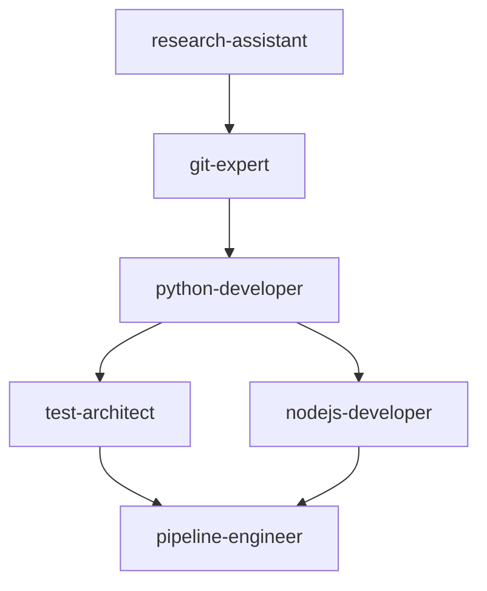

# Agent Queue & Coordination

**Last Updated**: `2025-01-16T10:33:00Z`

## Active Agents

### 🔄 git-expert
- **Status**: ACTIVE
- **Task**: Creating feature branch and initial setup
- **Started**: 10:31:00Z
- **Expected Completion**: 10:35:00Z
- **Output File**: `.claude/docs/git-expert-output.md`
- **Context Needed**: Project requirements from research-assistant
- **Next Agent**: python-developer (dependencies: branch setup)

## Queued Agents

### ⏳ python-developer (Priority: HIGH)
- **Status**: QUEUED
- **Task**: Implement User model and authentication schema
- **Dependencies**: git-expert completion ✅
- **Estimated Start**: 10:35:00Z
- **Context Files to Read**:
  - `.claude/docs/research-analysis.md`
  - `.claude/docs/git-expert-output.md`
  - `.claude/tasks/inter-agent-context.json`

### ⏳ test-architect (Priority: MEDIUM)
- **Status**: QUEUED
- **Task**: Create comprehensive test suite
- **Dependencies**: python-developer API completion
- **Estimated Start**: 10:45:00Z
- **Context Files to Read**:
  - `.claude/docs/python-developer-output.md`
  - `.claude/docs/git-expert-output.md`

## Completed Agents

### ✅ research-assistant
- **Completed**: 10:31:00Z
- **Task**: Project analysis and requirements gathering
- **Output**: `.claude/docs/research-analysis.md`
- **Result**: SUCCESS - Requirements documented

## Agent Coordination Rules

1. **Before Starting**: Each agent MUST read:
   - `.claude/tasks/inter-agent-context.json`
   - Any output files from dependency agents
   - Current workflow status

2. **During Execution**: Update progress in:
   - `.claude/status/agent-name-progress.md`

3. **After Completion**:
   - Write results to `.claude/docs/agent-name-output.md`
   - Update `.claude/tasks/inter-agent-context.json`
   - Mark status as COMPLETED

## Inter-Agent Dependencies

## Emergency Protocols

- **Agent Failure**: Mark as FAILED, notify main agent, assign fallback
- **Blocking Issue**: Pause queue, escalate to main agent
- **Context Conflict**: Use latest timestamp, log conflict

---
*Next update scheduled: When git-expert completes*
